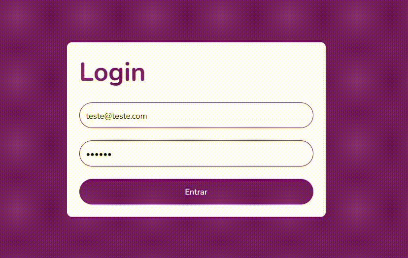

# Desafio 4 DIO, Tela de login com validação em typescript

Tecnologias:

Execução do projeto:
- Extraí a pasta;
- No terminal entre na pasta do projeto e execute o comando abaixo para executar:
> npm start

 

  

